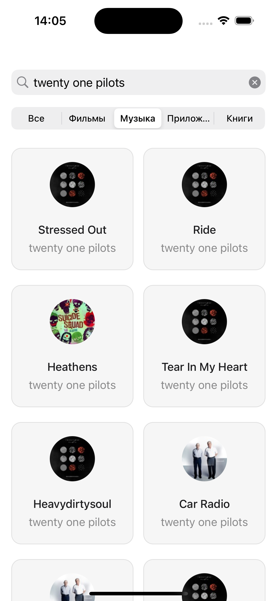

#  iTunesApp

This app helps users search for content on iTunes easily. It uses the iTunes Search API to quickly find what you need. Items you've viewed before are saved using CoreData, so you can go back to them anytime. You can also open items for detailed viewing. The app also has caching for better performance and supports both Russian and English languages.

 

